# PlantUML Diagrams for InteractHub

File này chứa toàn bộ code PlantUML cho các chức năng chính của dự án. Bạn có thể copy từng đoạn code này dán vào [PlantUML Online Server](http://www.plantuml.com/plantuml/uml/) để lấy hình ảnh.

---

## 0.1 Sơ đồ Use Case Tổng quan (Use Case Diagram)
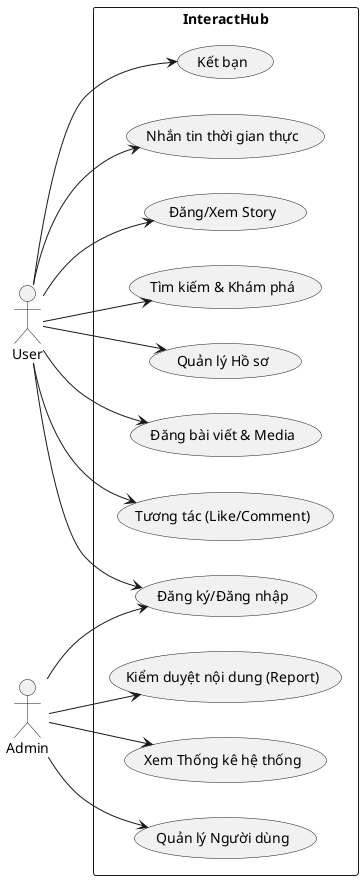

---

## 0.2 Sơ đồ Thực thể (ERD - Entity Relationship Diagram)
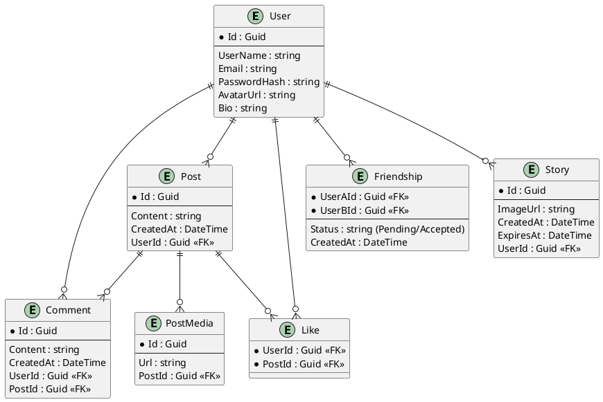

---

## 0.3 Sơ đồ Luồng dữ liệu (Data Flow Diagram - DFD)
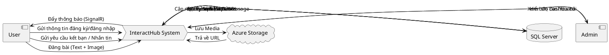

---

## 1. Chức năng Đăng ký & Đăng nhập (Auth Flow)
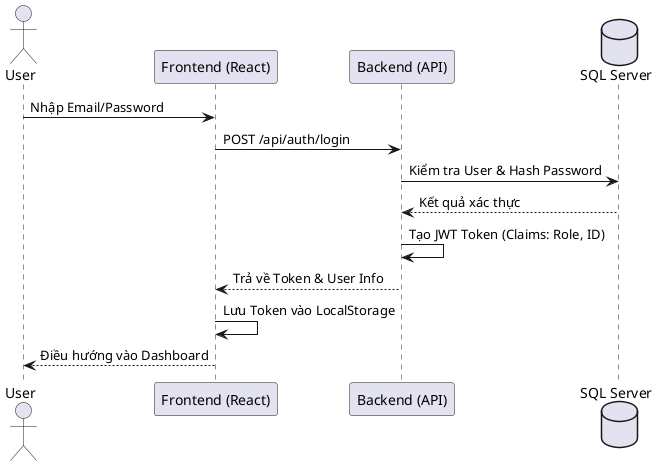

---

Sequence_Post
## 2. Chức năng Đăng bài viết kèm Hình ảnh (Post Creation)
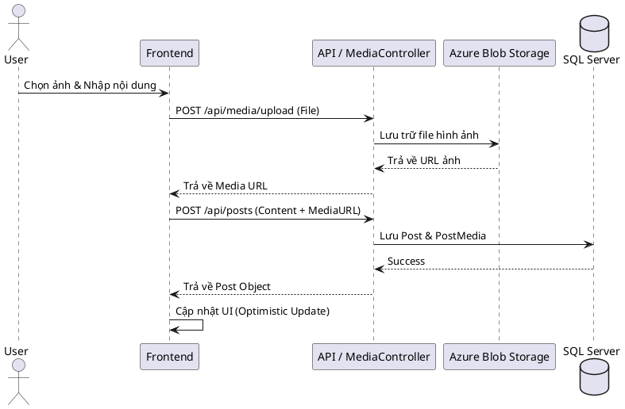

---

Sequence_Like_Noti
## 3. Chức năng Tương tác (Like bài viết)
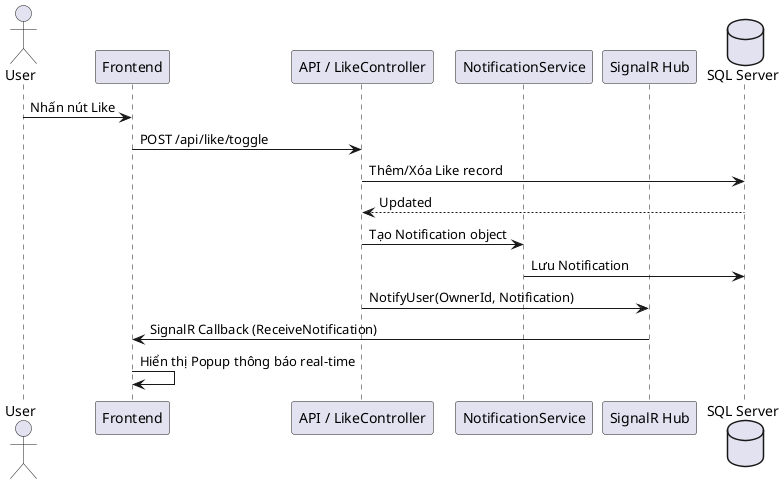

---

Sequence_Friendship
## 4. Chức năng Kết bạn (Friend Request)
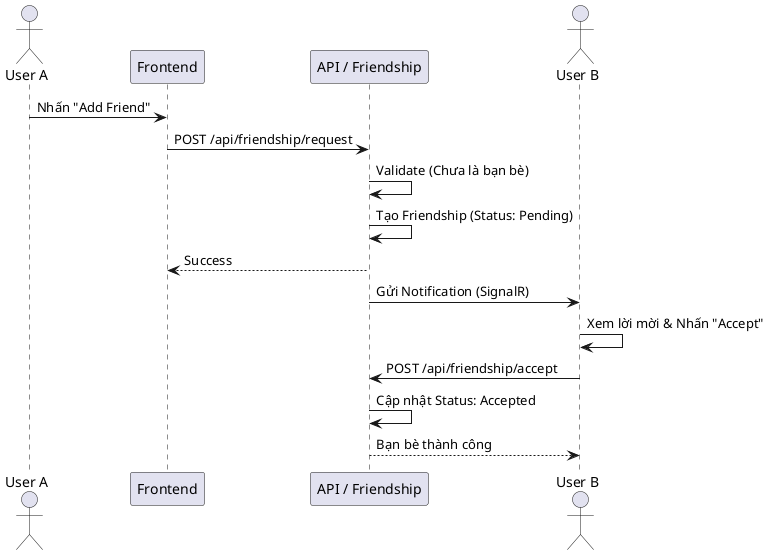

---

Sequence_Story
## 5. Chức năng Tin tạm thời (Story Flow)
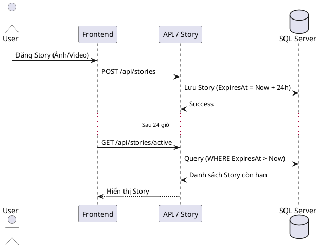

---

Sequence_Admin
## 6. Chức năng Quản trị & Thống kê (Admin Dashboard & Moderation)
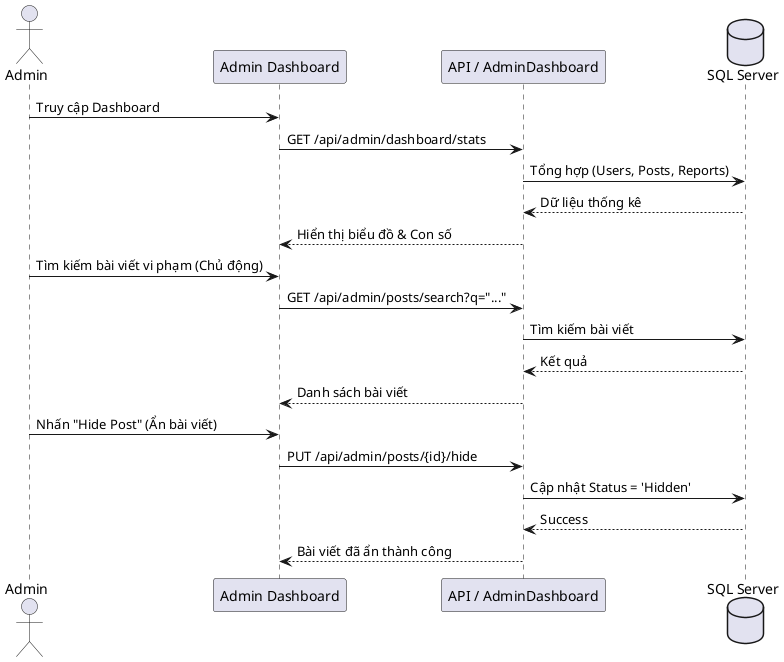

---

Sequence_Messaging
## 7. Chức năng Nhắn tin thời gian thực (Real-time Messaging)
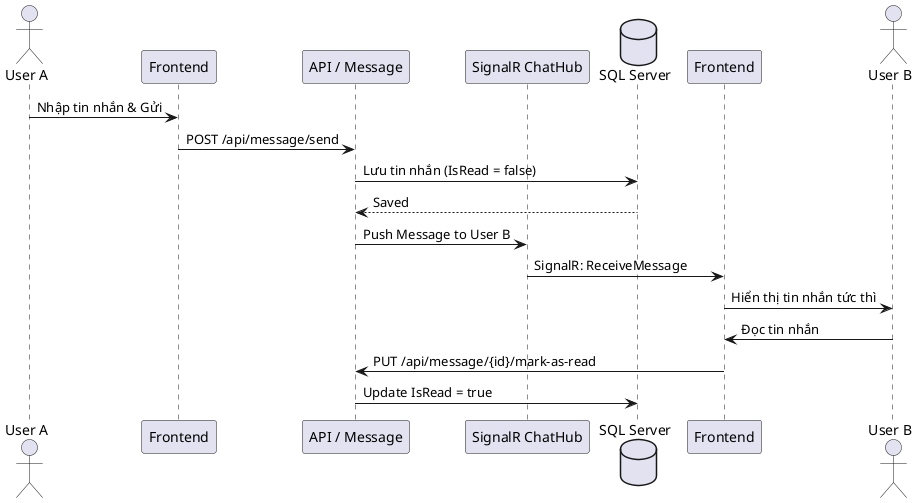

---

Sequence_Report_Management
## 8. Chức năng Quản lý Báo cáo (Report Management)
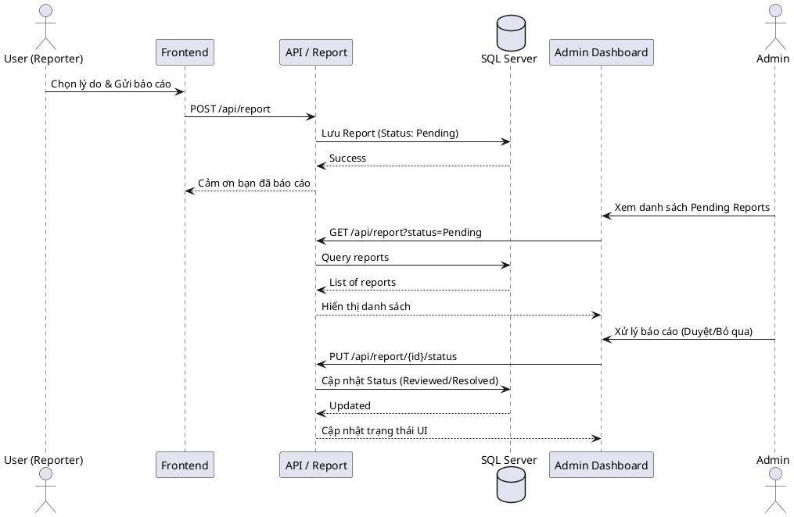

---

Sequence_User_Management
## 9. Chức năng Quản lý Người dùng (Admin User Management)
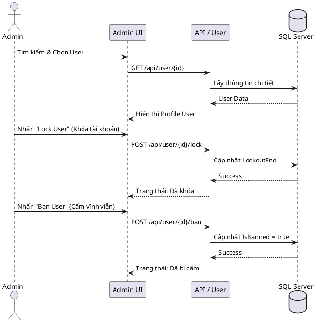

---

Sequence_Search
## 10. Chức năng Tìm kiếm & Khám phá (Search & Discovery)
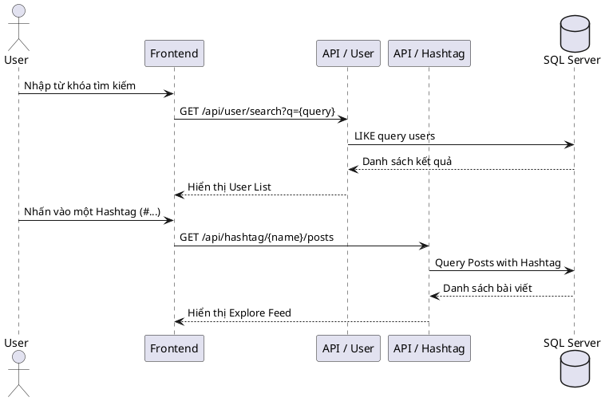
